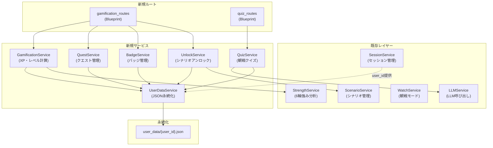

# ゲーミフィケーション機能 設計書

## 概要

本機能は、職場コミュニケーション練習アプリにゲーミフィケーション要素を追加し、ユーザーの継続的な学習モチベーションを支援する。既存の6軸強み分析（empathy, clarity, active_listening, adaptability, positivity, professionalism）を基盤として、スキルXP・成長グラフ、シナリオアンロック、デイリー/ウィークリークエスト、観戦モードクイズ、バッジシステムを実装する。

設計原則として「マスタリー可視化」を重視し、エンターテインメント型ゲーミフィケーション（ランキング、速度評価、過度なポイント）は採用しない。データ永続化はJSONファイルベースで行い、データベースは導入しない。

## アーキテクチャ

### 全体構成

既存のFlaskアプリケーション（Blueprint + サービス層パターン）に沿い、新規サービスとルートを追加する。



### 設計判断

1. **JSONファイル永続化を選択した理由**: 現在DBなしのアーキテクチャであり、要件でもJSON永続化が指定されている。ユーザー単位のファイル分割により、同時アクセス時の競合を最小化する。
2. **サービス分離の方針**: 単一の巨大なGamificationServiceではなく、責務ごとにサービスを分割（XP計算、クエスト、バッジ、アンロック、クイズ）。テスタビリティと保守性を確保する。
3. **既存サービスへの影響最小化**: 既存のStrengthService、ScenarioService、WatchServiceは変更せず、新規サービスから参照する形で統合する。

## コンポーネントとインターフェース

### 1. UserDataService（ユーザーデータ永続化）

```python
class UserDataService:
    """JSONファイルベースのユーザーデータ永続化サービス"""

    DATA_DIR = "user_data"

    def get_user_data(self, user_id: str) -> dict:
        """ユーザーデータを読み込む。存在しない/破損時はデフォルト値を返す"""

    def save_user_data(self, user_id: str, data: dict) -> None:
        """ユーザーデータをJSONファイルに保存する"""

    def _get_file_path(self, user_id: str) -> str:
        """ユーザーIDからファイルパスを生成"""

    def _create_default_data(self, user_id: str) -> dict:
        """デフォルトのユーザーデータを生成"""
```

### 2. GamificationService（XP・成長グラフ）

```python
class GamificationService:
    """スキルXP計算と成長データ管理"""

    def calculate_xp_from_scores(self, scores: dict, scenario_type: str) -> dict:
        """6軸スコアからXPを計算。ハラスメントシナリオは別扱い"""

    def add_xp(self, user_id: str, xp_gains: dict, source: str) -> dict:
        """XPを加算し、ユーザーデータを更新"""

    def get_growth_data(self, user_id: str) -> dict:
        """成長グラフ用データ（履歴、個人ベスト、週次比較、直近10回平均）を返す"""

    def get_skill_summary(self, user_id: str) -> dict:
        """現在のスキルXPサマリーを返す"""
```

### 3. UnlockService（シナリオアンロック）

```python
class UnlockService:
    """シナリオの段階的アンロック管理"""

    UNLOCK_THRESHOLDS = {
        "intermediate": 3,  # beginner完了数
        "advanced": 3,       # intermediate完了数
    }

    def get_unlock_status(self, user_id: str) -> dict:
        """全シナリオのアンロック状態を返す"""

    def check_and_unlock(self, user_id: str) -> list:
        """完了数に基づき新規アンロックを判定。アンロックされたレベルのリストを返す"""

    def is_scenario_unlocked(self, user_id: str, scenario_id: str) -> bool:
        """指定シナリオがアンロック済みか判定"""

    def get_unlock_progress(self, user_id: str) -> dict:
        """各レベルのアンロック進捗（現在値/必要値）を返す"""
```

### 4. QuestService（デイリー/ウィークリークエスト）

```python
class QuestService:
    """デイリー・ウィークリークエスト管理"""

    def get_active_quests(self, user_id: str) -> dict:
        """有効なデイリー/ウィークリークエストを返す。期限切れは自動更新"""

    def check_quest_completion(self, user_id: str, activity: dict) -> list:
        """アクティビティに基づきクエスト完了を判定。完了したクエストのリストを返す"""

    def generate_daily_quests(self, user_id: str) -> list:
        """デイリークエストを生成"""

    def generate_weekly_quests(self, user_id: str) -> list:
        """ウィークリークエストを生成"""

    def _is_quest_expired(self, quest: dict) -> bool:
        """クエストが期限切れか判定"""
```

### 5. QuizService（観戦モードクイズ）

```python
class QuizService:
    """観戦モード中のインタラクティブクイズ"""

    QUIZ_INTERVAL = 5  # 会話数ごとにクイズ生成

    def should_generate_quiz(self, message_count: int) -> bool:
        """クイズ生成タイミングか判定"""

    def generate_quiz(self, conversation_context: list) -> dict:
        """LLMを使用してコンテキストベースのクイズを生成（3-4択）"""

    def evaluate_answer(self, quiz: dict, user_answer: int, conversation_context: list) -> dict:
        """回答を評価し、LLMで解説を生成。正解時はボーナスXP情報を含む"""

    def get_session_summary(self, user_id: str, session_quizzes: list) -> dict:
        """セッション終了時のクイズ正答率サマリーを返す"""
```

### 6. BadgeService（バッジシステム）

```python
class BadgeService:
    """学習態度ベースのバッジ管理"""

    def check_badge_eligibility(self, user_id: str) -> list:
        """バッジ獲得条件をチェックし、新規獲得バッジのリストを返す"""

    def get_all_badges(self, user_id: str) -> dict:
        """全バッジ一覧（獲得済み/未獲得+条件+進捗）を返す"""

    def award_badge(self, user_id: str, badge_id: str) -> dict:
        """バッジを付与し、通知データを返す"""

    def get_badge_progress(self, user_id: str, badge_id: str) -> dict:
        """特定バッジの達成進捗を返す"""
```

### APIエンドポイント

```
# ゲーミフィケーション関連
GET  /api/gamification/dashboard     # ダッシュボード（XP、クエスト、バッジ概要）
GET  /api/gamification/growth        # 成長グラフデータ
GET  /api/gamification/quests        # アクティブクエスト一覧
GET  /api/gamification/badges        # バッジ一覧
GET  /api/gamification/unlock-status # シナリオアンロック状態

# 観戦クイズ関連
POST /api/quiz/generate              # クイズ生成
POST /api/quiz/answer                # クイズ回答・評価
GET  /api/quiz/summary               # セッションサマリー
```


## データモデル

### ユーザーデータ構造（user_data/{user_id}.json）

```json
{
  "user_id": "string",
  "created_at": "ISO8601",
  "updated_at": "ISO8601",

  "skill_xp": {
    "empathy": 0,
    "clarity": 0,
    "active_listening": 0,
    "adaptability": 0,
    "positivity": 0,
    "professionalism": 0
  },

  "xp_history": [
    {
      "timestamp": "ISO8601",
      "source": "scenario_completion | quiz_bonus | quest_bonus",
      "scenario_id": "string | null",
      "xp_gains": {
        "empathy": 10,
        "clarity": 5
      },
      "scores_snapshot": {
        "empathy": 75,
        "clarity": 60
      }
    }
  ],

  "scenario_completions": {
    "scenario1": {
      "count": 3,
      "first_completed_at": "ISO8601",
      "last_completed_at": "ISO8601",
      "best_scores": { "empathy": 85 },
      "difficulty": "beginner"
    }
  },

  "unlock_status": {
    "beginner": true,
    "intermediate": false,
    "advanced": false
  },

  "quests": {
    "daily": [
      {
        "quest_id": "daily_scenario_1",
        "type": "daily",
        "description": "シナリオを1つ完了する",
        "target_value": 1,
        "current_value": 0,
        "bonus_xp": 20,
        "created_at": "ISO8601",
        "expires_at": "ISO8601",
        "completed": false
      }
    ],
    "weekly": []
  },

  "badges": {
    "earned": [
      {
        "badge_id": "first_step",
        "earned_at": "ISO8601"
      }
    ]
  },

  "quiz_history": [
    {
      "timestamp": "ISO8601",
      "question": "string",
      "choices": ["A", "B", "C", "D"],
      "correct_answer": 0,
      "user_answer": 1,
      "is_correct": false,
      "xp_earned": 0
    }
  ],

  "stats": {
    "total_scenarios_completed": 0,
    "total_quizzes_answered": 0,
    "total_quizzes_correct": 0,
    "total_journal_entries": 0,
    "consecutive_days": 0,
    "last_activity_date": "YYYY-MM-DD",
    "unique_scenarios_tried": 0
  }
}
```

### バッジ定義

バッジは学習態度ベースで、以下の3カテゴリに分類する：

| カテゴリ | バッジID | 名称 | 条件 |
|---------|---------|------|------|
| 継続性 | `first_step` | はじめの一歩 | 初回シナリオ完了 |
| 継続性 | `three_day_streak` | 3日連続 | 3日連続アクティビティ |
| 継続性 | `seven_day_streak` | 1週間の習慣 | 7日連続アクティビティ |
| 多様性 | `explorer` | 探検家 | 5種類以上のシナリオを体験 |
| 多様性 | `all_rounder` | オールラウンダー | 全6軸でXP獲得 |
| 多様性 | `quiz_challenger` | クイズチャレンジャー | クイズ10問回答 |
| 改善度 | `growth_spurt` | 急成長 | いずれかの軸で週次+20%改善 |
| 改善度 | `personal_best` | 自己ベスト更新 | いずれかの軸で過去最高スコア |
| 改善度 | `balanced_growth` | バランス成長 | 全6軸が平均以上 |

### クエストテンプレート

```python
DAILY_QUEST_TEMPLATES = [
    {"id": "daily_scenario", "description": "シナリオを{n}つ完了する", "target_key": "scenarios_today", "target_value": 1, "bonus_xp": 20},
    {"id": "daily_journal", "description": "ジャーナルに記入する", "target_key": "journal_today", "target_value": 1, "bonus_xp": 15},
    {"id": "daily_watch", "description": "観戦モードを体験する", "target_key": "watch_today", "target_value": 1, "bonus_xp": 15},
]

WEEKLY_QUEST_TEMPLATES = [
    {"id": "weekly_scenarios", "description": "シナリオを{n}つ完了する", "target_key": "scenarios_week", "target_value": 3, "bonus_xp": 50},
    {"id": "weekly_all_axes", "description": "全6軸でXPを獲得する", "target_key": "axes_gained_week", "target_value": 6, "bonus_xp": 60},
    {"id": "weekly_quiz", "description": "クイズに{n}問正解する", "target_key": "quiz_correct_week", "target_value": 5, "bonus_xp": 40},
]
```

### XP計算ロジック

```python
def calculate_xp_from_scores(scores: dict, scenario_type: str) -> dict:
    """
    6軸スコア（0-100）からXPを計算する。

    計算式: xp = score * weight
    - 通常シナリオ: weight = 1.0
    - ハラスメントシナリオ: weight = 1.0（同等だがラベルは「学習進捗」）

    各軸のXPは個別に計算・加算される。
    """
    weight = 1.0
    xp_gains = {}
    for axis, score in scores.items():
        xp_gains[axis] = int(score * weight)
    return xp_gains
```

### シナリオ難易度マッピング

既存のシナリオYAMLデータの `difficulty` フィールドを使用する。フィールドが存在しない場合は `"beginner"` をデフォルトとする。

```python
DIFFICULTY_LEVELS = ["beginner", "intermediate", "advanced"]

def get_scenario_difficulty(scenario_data: dict) -> str:
    """シナリオの難易度を取得。未設定の場合はbeginnerを返す"""
    return scenario_data.get("difficulty", "beginner")
```


## 正当性プロパティ（Correctness Properties）

*プロパティとは、システムのすべての有効な実行において成り立つべき特性や振る舞いのことである。人間が読める仕様と機械的に検証可能な正当性保証の橋渡しとなる形式的な記述である。*

### Property 1: ユーザーデータ保存・読み込みラウンドトリップ

*任意の*有効なユーザーデータ（スキルXP、バッジ、クエスト進捗、シナリオアンロック状態を含む）に対して、`save_user_data` で保存した後に `get_user_data` で読み込むと、元のデータと等価なオブジェクトが返される。

**Validates: Requirements 1.2, 1.3, 1.5**

### Property 2: 6軸スコアからのXP計算の正当性

*任意の*6軸スコア辞書（各軸0-100の整数値）に対して、`calculate_xp_from_scores` は全6軸のXP値を含む辞書を返し、各XP値は非負整数であり、入力スコアに比例する。

**Validates: Requirements 2.1, 2.2**

### Property 3: 成長データの自己比較計算

*任意の*XP履歴リスト（1件以上）に対して、`get_growth_data` が返す成長データは、個人ベスト・週次比較・直近10回平均の3つの比較指標を含み、直近10回平均は実際の直近N件（N ≤ 10）の算術平均と等しい。

**Validates: Requirements 2.4**

### Property 4: シナリオアンロック判定

*任意の*難易度レベル（intermediate, advanced）と完了数に対して、前段階の完了数が閾値以上の場合にのみ当該レベルがアンロックされ、閾値未満の場合はロック状態が維持される。

**Validates: Requirements 3.2, 3.3**

### Property 5: シナリオ一覧データの完全性

*任意の*ユーザーのアンロック状態に対して、`get_unlock_status` が返すシナリオ一覧の各エントリは、難易度レベルとアンロック状態を含み、ロック状態のエントリにはアンロック条件（必要完了数と現在の完了数）が含まれる。

**Validates: Requirements 3.4, 3.5**

### Property 6: クエスト生成の有効性

*任意の*ユーザーIDと日付に対して、`generate_daily_quests` および `generate_weekly_quests` が返すクエストリストの各クエストは、quest_id、description、target_value（正の整数）、bonus_xp（非負整数）、expires_at（未来の日時）を含む。

**Validates: Requirements 4.1, 4.2**

### Property 7: クエスト完了判定とXP付与

*任意の*クエスト（target_value = T）と現在値 C に対して、C ≥ T の場合にのみクエストが完了状態となり、完了時にはbonus_xp分のXPが付与される。また、クエストデータには常に現在値と目標値が含まれる。

**Validates: Requirements 4.3, 4.4**

### Property 8: 期限切れクエストの置き換え

*任意の*期限切れクエストリストに対して、`get_active_quests` を呼び出すと、返されるクエストリストに期限切れのクエストは含まれず、代わりに新しい有効なクエストが含まれる。

**Validates: Requirements 4.5**

### Property 9: クイズ生成タイミング判定

*任意の*非負整数 message_count に対して、`should_generate_quiz(message_count)` は message_count が QUIZ_INTERVAL の正の倍数の場合にのみ True を返す。

**Validates: Requirements 5.1**

### Property 10: クイズ選択肢数の不変条件

*任意の*生成されたクイズデータに対して、choices フィールドの要素数は3以上4以下であり、correct_answer は有効なインデックス（0 ≤ correct_answer < len(choices)）である。

**Validates: Requirements 5.2**

### Property 11: クイズ正解時のXP付与

*任意の*クイズと回答に対して、user_answer == correct_answer の場合にのみボーナスXPが正の値で付与され、不正解の場合はXP付与が0である。

**Validates: Requirements 5.4**

### Property 12: クイズ正答率計算

*任意の*クイズ回答履歴リスト（1件以上）に対して、`get_session_summary` が返す正答率は、is_correct が True の件数を総件数で割った値と等しい。

**Validates: Requirements 5.5**

### Property 13: バッジ獲得条件判定

*任意の*ユーザー統計データとバッジ定義に対して、バッジの獲得条件を満たすユーザーには当該バッジが付与され、条件を満たさないユーザーには付与されない。

**Validates: Requirements 6.1**

### Property 14: バッジ一覧の完全性

*任意の*ユーザーデータに対して、`get_all_badges` が返すバッジ一覧は全定義バッジを含み、各バッジには獲得状態（earned/not_earned）が含まれ、未獲得バッジには達成条件と現在の進捗（current_value/target_value）が含まれる。

**Validates: Requirements 6.3, 6.5**

## エラーハンドリング

### ユーザーデータ永続化

| エラー状況 | 対応 |
|-----------|------|
| JSONファイルが存在しない | デフォルト値で新規作成 |
| JSONファイルが破損（パースエラー） | デフォルト値で新規作成、破損ファイルは `.bak` にリネーム |
| ファイル書き込み失敗（権限/ディスク） | エラーログ出力、セッションデータで継続 |
| user_data ディレクトリが存在しない | 自動作成 |

### XP計算

| エラー状況 | 対応 |
|-----------|------|
| スコアが0-100の範囲外 | 0-100にクランプ |
| スコアキーが不足 | 不足キーは0として扱う |

### クイズ生成（LLM依存）

| エラー状況 | 対応 |
|-----------|------|
| LLM API呼び出し失敗 | クイズ生成をスキップ、次のインターバルで再試行 |
| LLMレスポンスのパース失敗 | フォールバッククイズ（定型）を使用 |
| 選択肢数が3-4の範囲外 | 再生成を1回試行、失敗時はフォールバック |

### クエスト管理

| エラー状況 | 対応 |
|-----------|------|
| クエスト生成時のテンプレート不足 | 利用可能なテンプレートからランダム選択 |
| 日付計算エラー | 現在時刻をフォールバックとして使用 |

## テスト戦略

### テストフレームワーク

- ユニットテスト: `pytest`
- プロパティベーステスト: `hypothesis`（Python用PBTライブラリ）
- カバレッジ: `pytest-cov`

### プロパティベーステスト設定

- 各プロパティテストは最低100イテレーション実行
- 各テストにはデザインドキュメントのプロパティ番号をタグとしてコメントに記載
- タグ形式: `# Feature: gamification, Property {number}: {property_text}`

### テスト構成

```
tests/
  test_services/
    test_user_data_service.py      # UserDataService ユニット + PBT
    test_gamification_service.py   # GamificationService ユニット + PBT
    test_unlock_service.py         # UnlockService ユニット + PBT
    test_quest_service.py          # QuestService ユニット + PBT
    test_quiz_service.py           # QuizService ユニット + PBT
    test_badge_service.py          # BadgeService ユニット + PBT
```

### ユニットテスト（具体例・エッジケース）

ユニットテストは以下の観点に集中する：

- 具体的な入出力例（正常系）
- エッジケース（空データ、破損JSON、境界値）
- エラー条件（ファイルI/Oエラー、LLM障害）
- 統合ポイント（既存サービスとの連携）

主なエッジケース：
- 1.4: 破損JSONファイル、存在しないファイル → デフォルト値生成
- 2.5: ハラスメントシナリオのラベル確認
- 3.1: 新規ユーザーの初期アンロック状態（beginnerのみ）
- 5.3: LLMレスポンスのパース失敗時のフォールバック
- 6.2: バッジカテゴリが3種類（継続性、多様性、改善度）であること
- 6.4: バッジ獲得時の通知データ生成

### プロパティベーステスト（普遍的プロパティ）

各正当性プロパティに対して1つのプロパティベーステストを実装する。Hypothesisのストラテジーを使用してランダム入力を生成する。

```python
# 例: Property 1 - ユーザーデータラウンドトリップ
# Feature: gamification, Property 1: ユーザーデータ保存・読み込みラウンドトリップ
@given(user_data=st.fixed_dictionaries({
    "skill_xp": st.fixed_dictionaries({
        axis: st.integers(min_value=0, max_value=10000)
        for axis in ["empathy", "clarity", "active_listening",
                     "adaptability", "positivity", "professionalism"]
    }),
    # ... 他のフィールド
}))
@settings(max_examples=100)
def test_user_data_round_trip(user_data):
    service = UserDataService()
    user_id = "test_user"
    service.save_user_data(user_id, user_data)
    loaded = service.get_user_data(user_id)
    assert loaded == user_data
```

### テスト実行コマンド

```bash
# 全テスト実行
pytest tests/test_services/test_user_data_service.py tests/test_services/test_gamification_service.py tests/test_services/test_unlock_service.py tests/test_services/test_quest_service.py tests/test_services/test_quiz_service.py tests/test_services/test_badge_service.py -v

# カバレッジ付き
pytest tests/test_services/ -k "gamification or user_data or unlock or quest or quiz or badge" --cov=services --cov-report=term-missing
```
