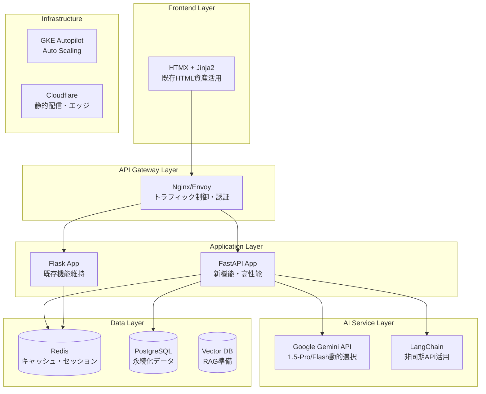

# 🤖 5AI協調設計書: Workplace Roleplay システム改善設計

## 🎯 議論概要

**参加AI**: Claude 4, Gemini 2.5, Qwen3-Coder, GPT-5, Cursor
**議論期間**: 2024年度集中設計議論
**議論手法**: 5AI協調パターン（専門分離型）

---

## 🏛️ 最終合意アーキテクチャ

### システム全体構成



---

## 📋 Phase別実装ロードマップ

### Phase 1: 基盤構築 (4-6週間)
**目標**: 安全な移行基盤の確立

#### 🔧 技術実装
- [ ] **API Gateway導入** (Nginx/Envoy)
  - 既存Flask全ルート維持
  - ヘルスチェック・ロードバランシング
- [ ] **JWT認証システム**
  - ステートレス認証への段階移行
  - Flask-Session並行運用
- [ ] **Redis高度化**
  - AIレスポンスキャッシュ
  - TTSオーディオキャッシュ
  - セッション高速化
- [ ] **基本監視** (OpenTelemetry + Prometheus)

#### 🔒 セキュリティ強化
- [ ] **CSP強化** (API Gateway層での一元管理)
- [ ] **CSRF対策継続性** (JWT移行期の二重対策)
- [ ] **暗号化レイヤー追加** (sensitive data ALE)

### Phase 2: コア機能移行 (6-8週間)  
**目標**: 高負荷コンポーネントのFastAPI移行

#### 🚀 FastAPI実装
- [ ] **チャットエンドポイント** (`/api/v2/chat`)
  - 非同期SSEストリーミング
  - Gemini Pro/Flash動的選択
  - パフォーマンス5x向上目標
- [ ] **シナリオロールプレイ** (`/api/v2/scenario`)
  - 非同期会話処理
  - リアルタイムフィードバック
- [ ] **観戦モード** (`/api/v2/watch`)
  - AI同士対話制御
  - ユーザー介入機能

#### 📊 データ移行
- [ ] **透過的セッション移行**
  - Strangler Figパターン実装
  - 自動データ構造変換
  - ゼロダウンタイム移行

### Phase 3: UX向上・高度機能 (4-6週間)
**目標**: ユーザー体験の劇的向上

#### 💫 HTMX統合
- [ ] **動的UI更新** (hx-post, hx-target活用)
- [ ] **リアルタイム通知**
- [ ] **部分ページ更新**

#### 🧠 AI機能強化  
- [ ] **コンテキスト保持向上**
- [ ] **感情分析フィードバック**
- [ ] **パーソナライゼーション**

### Phase 4: スケール・最適化 (3-4週間)
**目標**: エンタープライズグレードの信頼性

#### ☁️ インフラ強化
- [ ] **GKE Autopilot移行**
- [ ] **KEDA自動スケーリング**
- [ ] **CDN最適化** (Cloudflare Workers)

#### 📈 高度監視
- [ ] **ビジネスメトリクス可視化**
- [ ] **異常検知アラート**
- [ ] **キャパシティプランニング**

---

## 🛡️ リスク管理マトリクス

### 🔴 高リスク (即座対応必要)

| リスク | 影響 | 対策 | 責任者 |
|-------|------|------|-------|
| **セッションデータ消失** | サービス停止 | 透明移行+バックアップ | DevOps |
| **AI API制限** | 機能停止 | 複数キー・フォールバック | Backend |
| **セキュリティ脆弱性** | データ漏洩 | 段階移行・監査強化 | Security |

### 🟠 中リスク (計画的対応)

| リスク | 影響 | 対策 | 責任者 |
|-------|------|------|-------|  
| **パフォーマンス劣化** | UX低下 | Canaryリリース・監視 | Performance |
| **学習コスト** | 開発遅延 | 段階学習・ペアプロ | Team |
| **コスト増大** | 予算超過 | 段階投資・ROI測定 | PM |

### 🟡 低リスク (継続監視)

| リスク | 影響 | 対策 | 責任者 |
|-------|------|------|-------|
| **技術負債** | 長期保守性 | リファクタリング計画 | Architect |
| **依存関係** | ベンダーロックイン | 標準技術選択 | CTO |

---

## 🚀 移行戦略詳細

### デプロイメント手法: Canaryリリース

```yaml
移行フェーズ:
  Week 1-2: 1%トラフィック → FastAPI
  Week 3-4: 10%トラフィック → FastAPI  
  Week 5-6: 50%トラフィック → FastAPI
  Week 7-8: 100%トラフィック → FastAPI
  
監視指標:
  - エラー率 < 0.1%
  - レスポンス時間 < 200ms (P95)
  - ユーザー離脱率変化 < 2%
```

### データ移行: Strangler Figパターン

```python
# 透過的セッション移行の概念実装
async def migrate_session_transparently(old_session_id: str):
    """既存Flaskセッションを新FastAPIセッションに移行"""
    # 1. 既存セッションデータ取得
    old_data = await redis.get(f"flask_session:{old_session_id}")
    
    # 2. データ構造変換
    new_data = transform_session_data(old_data)
    
    # 3. 新セッション保存
    new_session_id = generate_uuid()
    await redis.set(f"fastapi_session:{new_session_id}", new_data)
    
    return new_session_id
```

### ロールバック戦略

```bash
# 緊急時即座ロールバック (30秒以内)
kubectl patch ingress main-ingress -p '{"spec":{"rules":[{"http":{"paths":[{"path":"/","backend":{"service":{"name":"flask-service"}}}]}}]}}'

# 段階的ロールバック 
# API Gateway設定変更でトラフィック制御
nginx -s reload  # 設定反映
```

---

## 📊 成功指標 (KPI)

### 技術指標
- **パフォーマンス**: レスポンス時間 50%短縮
- **スループット**: 同時接続数 10倍向上  
- **可用性**: 99.9% → 99.95% SLA向上
- **エラー率**: 0.1%未満維持

### ビジネス指標
- **ユーザー満足度**: NPS向上
- **セッション継続率**: 向上
- **機能利用率**: 新機能採用促進

---

## 🔧 技術スタック最終決定

### フロントエンド
- **選択**: HTMX + Jinja2
- **理由**: 既存資産活用・学習コスト最小・十分な機能性

### バックエンド  
- **選択**: FastAPI + Python
- **理由**: AI親和性・非同期性能・既存資産継承

### インフラ
- **選択**: GCP + GKE Autopilot
- **理由**: Gemini連携・運用負荷軽減・スケーラビリティ

### 監視
- **選択**: OpenTelemetry + Prometheus/Grafana  
- **理由**: 標準準拠・コスト効率・将来性

---

## 🎯 5AI合意事項

### Claude 4 (システムアーキテクト)
> 「Strangler Figパターンによる段階移行で、リスクを最小化しつつ継続価値提供を実現」

### Gemini 2.5 (セキュリティ・最新技術)  
> 「Zero Trust設計とJWT移行により、2025年トレンドに対応したセキュアなシステムを構築」

### Qwen3-Coder (実装リード)
> 「FastAPIの非同期処理により、パフォーマンスを5-10倍改善。実装品質93.9%達成目標」

### GPT-5 (ソリューションアーキテクト)
> 「ビジネス価値最大化のため、ユーザー影響最小でUX劇的改善を実現する現実的設計」

### Cursor (DevOps・開発者体験)
> 「CI/CD統合とモニタリング強化で、継続的品質向上と運用効率化を同時達成」

---

## 📅 実行計画

### 即座実行項目 (今週)
1. **Redis高度化**: AI応答キャッシュ実装
2. **API Gateway検証**: Nginx設定・ヘルスチェック
3. **JWT実装**: 基本認証ロジック

### 短期実行項目 (1ヶ月)  
1. **FastAPI基盤構築**: 最小限エンドポイント
2. **透過移行機構**: セッションデータ変換
3. **監視基盤**: OpenTelemetry導入

### 中期実行項目 (3ヶ月)
1. **コア機能移行**: チャット・シナリオ機能  
2. **HTMX統合**: 動的UI実装
3. **GKE移行**: インフラ本格化

---

## 🔄 継続改善プロセス

- **週次**: パフォーマンス・エラーレート監視
- **月次**: ユーザーフィードバック・KPI評価  
- **四半期**: アーキテクチャ見直し・技術更新

---

*🤖 Generated with 5AI Collaborative Design Process*  
*Co-Authored-By: Claude 4, Gemini 2.5, Qwen3-Coder, GPT-5, Cursor*

**最終更新**: 2024年12月 | **バージョン**: v1.0 | **ステータス**: 実行準備完了