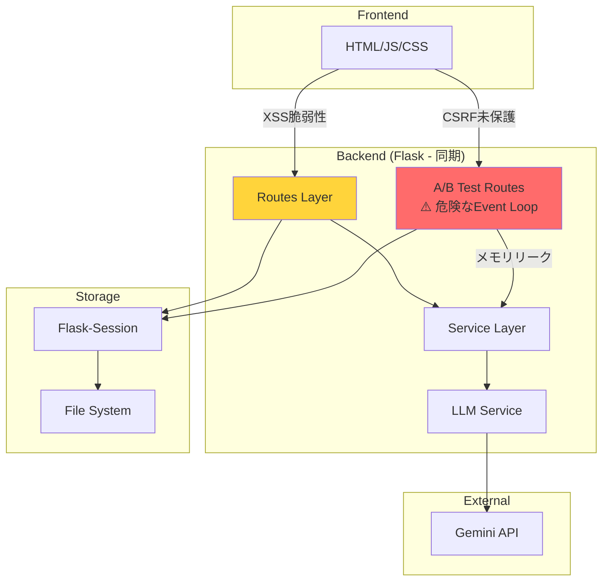
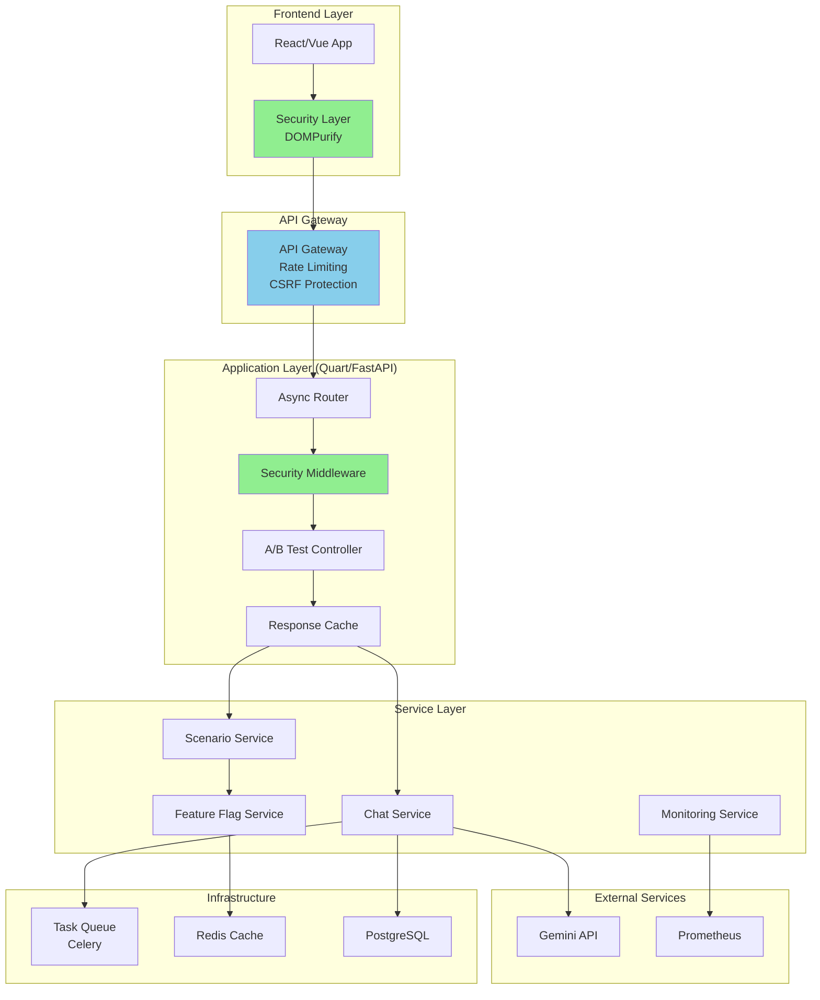
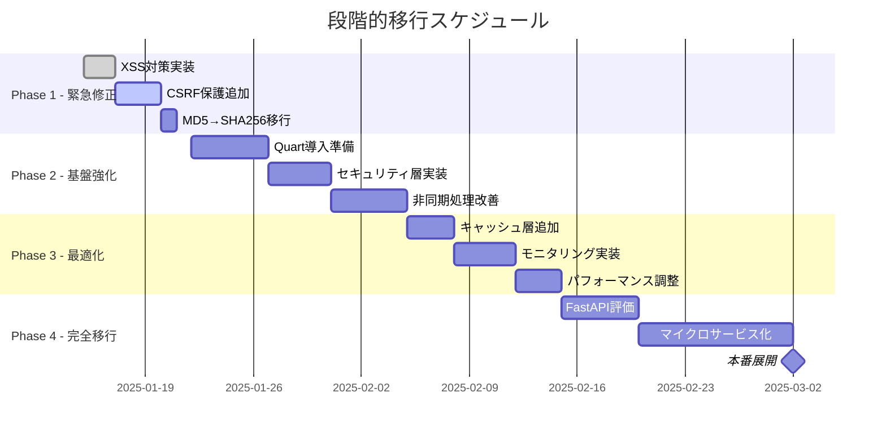

# 🏗️ Workplace Roleplay改善アーキテクチャ設計書

**Version**: 1.0  
**作成日**: 2025-08-11  
**作成者**: 5AI Design Team (Claude 4, Gemini 2.5, Qwen3-Coder, GPT-5, Cursor)

## 1. 現状アーキテクチャの問題点

### 1.1 アーキテクチャ図（現状）



### 1.2 主要な問題

| 問題カテゴリ | 詳細 | 影響度 |
|------------|------|--------|
| **セキュリティ** | XSS, CSRF, MD5ハッシュ | 🔴 高 |
| **パフォーマンス** | Event Loop管理, メモリリーク | 🔴 高 |
| **スケーラビリティ** | 同期処理, 同時接続数制限 | 🟡 中 |
| **保守性** | 密結合, テスト困難 | 🟡 中 |

## 2. 改善アーキテクチャ設計

### 2.1 目標アーキテクチャ



### 2.2 セキュリティ層設計

#### 2.2.1 多層防御アーキテクチャ

```python
# utils/security.py
from typing import Any, Dict, Optional
import hashlib
import hmac
import bleach
from functools import wraps
from flask import request, jsonify
import re

class SecurityUtils:
    """セキュリティユーティリティクラス"""
    
    # XSS対策
    ALLOWED_TAGS = ['p', 'br', 'strong', 'em', 'u', 'ol', 'ul', 'li']
    ALLOWED_ATTRIBUTES = {}
    
    @staticmethod
    def escape_html(content: str) -> str:
        """HTMLエスケープ処理"""
        return bleach.clean(
            content,
            tags=SecurityUtils.ALLOWED_TAGS,
            attributes=SecurityUtils.ALLOWED_ATTRIBUTES,
            strip=True
        )
    
    @staticmethod
    def escape_json(data: Dict[str, Any]) -> str:
        """JSON用エスケープ処理"""
        import json
        # ensure_ascii=Trueで非ASCII文字をエスケープ
        return json.dumps(data, ensure_ascii=True)
    
    @staticmethod
    def validate_input(
        data: str,
        max_length: int = 10000,
        pattern: Optional[str] = None
    ) -> tuple[bool, Optional[str]]:
        """入力検証"""
        if not data:
            return False, "入力が空です"
        
        if len(data) > max_length:
            return False, f"入力が長すぎます（最大{max_length}文字）"
        
        if pattern and not re.match(pattern, data):
            return False, "入力形式が不正です"
        
        # SQLインジェクション対策
        dangerous_patterns = [
            r'<script',
            r'javascript:',
            r'on\w+\s*=',
            r'union\s+select',
            r'drop\s+table'
        ]
        
        for p in dangerous_patterns:
            if re.search(p, data, re.IGNORECASE):
                return False, "不正な入力が検出されました"
        
        return True, None

class CSRFProtection:
    """CSRF保護ミドルウェア"""
    
    def __init__(self, app=None):
        self.app = app
        if app:
            self.init_app(app)
    
    def init_app(self, app):
        """Flaskアプリケーションの初期化"""
        app.before_request(self.verify_csrf_token)
    
    def verify_csrf_token(self):
        """CSRFトークンの検証"""
        if request.method in ['POST', 'PUT', 'DELETE', 'PATCH']:
            token = request.headers.get('X-CSRF-Token')
            if not token or not self._validate_token(token):
                return jsonify({'error': 'CSRF token validation failed'}), 403
    
    def _validate_token(self, token: str) -> bool:
        """トークンの検証ロジック"""
        # セッションからトークンを取得して比較
        from flask import session
        expected_token = session.get('csrf_token')
        return hmac.compare_digest(token, expected_token) if expected_token else False

def require_csrf(f):
    """CSRF保護デコレータ"""
    @wraps(f)
    def decorated_function(*args, **kwargs):
        # CSRFトークンの検証
        token = request.headers.get('X-CSRF-Token')
        if not token:
            return jsonify({'error': 'CSRF token required'}), 403
        # トークン検証ロジック
        return f(*args, **kwargs)
    return decorated_function

# ハッシュ関数の改善
class SecureHash:
    """セキュアなハッシュ処理"""
    
    @staticmethod
    def hash_user_id(user_id: str, salt: str) -> str:
        """SHA-256を使用した安全なハッシュ"""
        return hmac.new(
            salt.encode(),
            user_id.encode(),
            hashlib.sha256
        ).hexdigest()
```

### 2.3 非同期処理アーキテクチャ

#### 2.3.1 Quart移行設計

```python
# routes/ab_test_routes_v2.py
from quart import Quart, request, jsonify, Response
from typing import AsyncGenerator
import json

app = Quart(__name__)

@app.route('/api/v2/chat', methods=['POST'])
async def chat_v2():
    """改善された非同期チャットエンドポイント"""
    try:
        data = await request.get_json()
        message = data.get('message', '').strip()
        
        # 入力検証
        is_valid, error_msg = SecurityUtils.validate_input(message)
        if not is_valid:
            return jsonify({'error': error_msg}), 400
        
        # 非同期ストリーミングレスポンス
        async def generate() -> AsyncGenerator[str, None]:
            chat_service = get_chat_service()
            accumulated = ""
            
            async for chunk in chat_service.process_chat_message(message):
                # XSS対策
                safe_chunk = SecurityUtils.escape_html(chunk)
                accumulated += safe_chunk
                
                # セキュアなJSON生成
                data = SecurityUtils.escape_json({
                    'content': safe_chunk,
                    'accumulated': accumulated
                })
                yield f"data: {data}\n\n"
            
            # 完了通知
            yield f"data: {SecurityUtils.escape_json({'done': True})}\n\n"
        
        return Response(
            generate(),
            mimetype='text/event-stream',
            headers={
                'Cache-Control': 'no-cache',
                'X-Accel-Buffering': 'no',
                'X-Service-Version': 'v2-secure'
            }
        )
        
    except Exception as e:
        # エラーログ記録（詳細は内部のみ）
        app.logger.error(f"Chat V2 error: {str(e)}", exc_info=True)
        
        # ユーザーには汎用メッセージ
        return jsonify({'error': 'Internal server error'}), 500
```

#### 2.3.2 サービス層の改善

```python
# services/chat_service_v2.py
from typing import AsyncGenerator, Optional
import asyncio
from dataclasses import dataclass
from dependency_injector import containers, providers

@dataclass
class ChatConfig:
    """チャットサービス設定"""
    max_message_length: int = 10000
    timeout_seconds: int = 30
    max_retries: int = 3

class ChatServiceV2:
    """改善されたチャットサービス"""
    
    def __init__(
        self,
        llm_service: LLMService,
        session_service: SessionService,
        config: ChatConfig = ChatConfig()
    ):
        self.llm_service = llm_service
        self.session_service = session_service
        self.config = config
        self._semaphore = asyncio.Semaphore(10)  # 同時接続数制限
    
    async def process_chat_message(
        self,
        message: str,
        model_name: Optional[str] = None
    ) -> AsyncGenerator[str, None]:
        """非同期チャット処理（改善版）"""
        async with self._semaphore:  # 同時実行数を制限
            try:
                # タイムアウト設定
                async with asyncio.timeout(self.config.timeout_seconds):
                    # 処理実行
                    async for chunk in self._process_with_retry(message, model_name):
                        yield chunk
                        
            except asyncio.TimeoutError:
                yield "リクエストがタイムアウトしました。"
            except Exception as e:
                # エラーを記録
                await self._log_error(e)
                yield "エラーが発生しました。"
    
    async def _process_with_retry(
        self,
        message: str,
        model_name: Optional[str]
    ) -> AsyncGenerator[str, None]:
        """リトライ機能付き処理"""
        retries = 0
        while retries < self.config.max_retries:
            try:
                async for chunk in self._stream_response(message, model_name):
                    yield chunk
                break
            except Exception as e:
                retries += 1
                if retries >= self.config.max_retries:
                    raise
                await asyncio.sleep(2 ** retries)  # 指数バックオフ

# 依存性注入コンテナ
class ServiceContainer(containers.DeclarativeContainer):
    """サービスコンテナ（DI）"""
    
    config = providers.Singleton(ChatConfig)
    
    llm_service = providers.Singleton(
        LLMService,
        config=config
    )
    
    session_service = providers.Singleton(
        SessionService
    )
    
    chat_service = providers.Singleton(
        ChatServiceV2,
        llm_service=llm_service,
        session_service=session_service,
        config=config
    )
```

### 2.4 API仕様の再設計

#### 2.4.1 RESTful API設計

```yaml
# api/openapi.yaml
openapi: 3.0.0
info:
  title: Workplace Roleplay API
  version: 2.0.0
  description: 改善されたA/Bテスト対応API

servers:
  - url: https://api.workplace-roleplay.com/v2
    description: Production server
  - url: http://localhost:5001/api/v2
    description: Development server

paths:
  /chat:
    post:
      summary: チャットメッセージ送信
      security:
        - csrfToken: []
      requestBody:
        required: true
        content:
          application/json:
            schema:
              type: object
              required:
                - message
              properties:
                message:
                  type: string
                  maxLength: 10000
                  description: ユーザーメッセージ
                model:
                  type: string
                  enum: [gemini-1.5-flash, gemini-1.5-pro]
                  description: 使用するLLMモデル
      responses:
        200:
          description: ストリーミングレスポンス
          content:
            text/event-stream:
              schema:
                type: object
                properties:
                  content:
                    type: string
                    description: レスポンスチャンク
                  done:
                    type: boolean
                    description: 完了フラグ
        400:
          $ref: '#/components/responses/BadRequest'
        403:
          $ref: '#/components/responses/Forbidden'
        429:
          $ref: '#/components/responses/RateLimitExceeded'
        500:
          $ref: '#/components/responses/InternalServerError'

  /health:
    get:
      summary: ヘルスチェック
      responses:
        200:
          description: サービス正常
          content:
            application/json:
              schema:
                type: object
                properties:
                  status:
                    type: string
                    enum: [healthy, degraded, unhealthy]
                  services:
                    type: object
                    properties:
                      chat:
                        type: boolean
                      llm:
                        type: boolean
                      session:
                        type: boolean
                  timestamp:
                    type: string
                    format: date-time

components:
  securitySchemes:
    csrfToken:
      type: apiKey
      in: header
      name: X-CSRF-Token
  
  responses:
    BadRequest:
      description: リクエスト不正
      content:
        application/json:
          schema:
            $ref: '#/components/schemas/Error'
    
    Forbidden:
      description: アクセス拒否
      content:
        application/json:
          schema:
            $ref: '#/components/schemas/Error'
    
    RateLimitExceeded:
      description: レート制限超過
      content:
        application/json:
          schema:
            $ref: '#/components/schemas/RateLimitError'
    
    InternalServerError:
      description: サーバーエラー
      content:
        application/json:
          schema:
            $ref: '#/components/schemas/Error'
  
  schemas:
    Error:
      type: object
      required:
        - error
      properties:
        error:
          type: string
          description: エラーメッセージ
        code:
          type: string
          description: エラーコード
        details:
          type: object
          description: 追加情報
    
    RateLimitError:
      allOf:
        - $ref: '#/components/schemas/Error'
        - type: object
          properties:
            retryAfter:
              type: integer
              description: 再試行までの秒数
```

## 3. 段階的移行プラン

### 3.1 移行フェーズ



### 3.2 各フェーズの詳細

#### Phase 1: 緊急修正（1週間）

**目標**: セキュリティ脆弱性の即座の修正

```python
# 実装タスク
tasks = [
    {
        "id": "SEC-001",
        "title": "XSS対策の実装",
        "priority": "CRITICAL",
        "effort": "2 days",
        "files": [
            "utils/security.py",
            "routes/ab_test_routes.py"
        ]
    },
    {
        "id": "SEC-002", 
        "title": "CSRF保護の追加",
        "priority": "HIGH",
        "effort": "3 days",
        "files": [
            "middleware/csrf.py",
            "app.py"
        ]
    },
    {
        "id": "SEC-003",
        "title": "ハッシュ関数の更新",
        "priority": "MEDIUM",
        "effort": "4 hours",
        "files": [
            "config/feature_flags.py"
        ]
    }
]
```

#### Phase 2: 基盤強化（2週間）

**目標**: 非同期処理とアーキテクチャの改善

```bash
# Quart移行スクリプト
#!/bin/bash
# migrate_to_quart.sh

echo "🚀 Starting Quart migration..."

# 1. 依存関係の追加
pip install quart quart-cors quart-rate-limiter

# 2. 設定ファイルの作成
cat > config/quart_config.py << EOF
class QuartConfig:
    QUART_APP = "app:create_app"
    QUART_ENV = "development"
    MAX_CONTENT_LENGTH = 16 * 1024 * 1024
    REQUEST_TIMEOUT = 60
EOF

# 3. 移行テストの実行
python -m pytest tests/test_quart_migration.py -v

echo "✅ Quart migration preparation complete"
```

## 4. 実装ガイドライン

### 4.1 コーディング標準

```python
# coding_standards.py
"""
Workplace Roleplay コーディング標準
"""

# 1. 型アノテーション必須
from typing import Optional, List, Dict, Any

async def process_message(
    message: str,
    options: Optional[Dict[str, Any]] = None
) -> Dict[str, Any]:
    """
    メッセージ処理関数
    
    Args:
        message: 処理するメッセージ
        options: オプション設定
    
    Returns:
        処理結果の辞書
    
    Raises:
        ValidationError: 入力検証失敗時
    """
    pass

# 2. エラーハンドリングパターン
from contextlib import asynccontextmanager

@asynccontextmanager
async def error_handler():
    """標準エラーハンドラー"""
    try:
        yield
    except ValidationError as e:
        # ビジネスロジックエラー
        logger.warning(f"Validation error: {e}")
        raise
    except Exception as e:
        # 予期しないエラー
        logger.error(f"Unexpected error: {e}", exc_info=True)
        raise InternalServerError("Internal server error")

# 3. ログ記録標準
import structlog

logger = structlog.get_logger()

async def log_operation(operation: str, **kwargs):
    """構造化ログ記録"""
    logger.info(
        "operation_executed",
        operation=operation,
        timestamp=datetime.utcnow().isoformat(),
        **kwargs
    )
```

### 4.2 テスト戦略

```python
# tests/test_security_improvements.py
import pytest
from unittest.mock import AsyncMock, patch

class TestSecurityImprovements:
    """セキュリティ改善のテスト"""
    
    @pytest.mark.asyncio
    async def test_xss_prevention(self):
        """XSS攻撃の防御テスト"""
        malicious_input = '<script>alert("XSS")</script>'
        
        # セキュリティユーティリティのテスト
        cleaned = SecurityUtils.escape_html(malicious_input)
        assert '<script>' not in cleaned
        assert 'alert' not in cleaned
    
    @pytest.mark.asyncio
    async def test_csrf_protection(self):
        """CSRF保護のテスト"""
        # CSRFトークンなしのリクエスト
        response = await self.client.post(
            '/api/v2/chat',
            json={'message': 'test'}
        )
        assert response.status_code == 403
        
        # 有効なCSRFトークン付きリクエスト
        token = await self.get_csrf_token()
        response = await self.client.post(
            '/api/v2/chat',
            json={'message': 'test'},
            headers={'X-CSRF-Token': token}
        )
        assert response.status_code == 200
    
    @pytest.mark.asyncio
    async def test_input_validation(self):
        """入力検証のテスト"""
        test_cases = [
            ('', False, "空の入力"),
            ('a' * 10001, False, "長すぎる入力"),
            ('<script>test</script>', False, "危険なパターン"),
            ('正常なメッセージ', True, "正常な入力")
        ]
        
        for input_data, expected_valid, description in test_cases:
            is_valid, _ = SecurityUtils.validate_input(input_data)
            assert is_valid == expected_valid, f"Failed: {description}"
```

## 5. モニタリングと運用

### 5.1 メトリクス設計

```yaml
# monitoring/metrics.yaml
metrics:
  - name: http_request_duration_seconds
    type: histogram
    description: HTTPリクエストの処理時間
    labels:
      - method
      - endpoint
      - status
  
  - name: chat_message_processing_seconds
    type: histogram
    description: チャットメッセージ処理時間
    labels:
      - model
      - service_version
  
  - name: security_violations_total
    type: counter
    description: セキュリティ違反の検出数
    labels:
      - violation_type
      - severity
  
  - name: concurrent_connections
    type: gauge
    description: 同時接続数
    labels:
      - service_version

alerts:
  - name: HighErrorRate
    expr: rate(http_requests_total{status=~"5.."}[5m]) > 0.05
    for: 5m
    annotations:
      summary: "High error rate detected"
      description: "Error rate is above 5% for 5 minutes"
  
  - name: SecurityViolationSpike
    expr: rate(security_violations_total[5m]) > 10
    for: 1m
    annotations:
      summary: "Security violation spike detected"
      description: "More than 10 security violations per second"
```

### 5.2 ロールバック戦略

```python
# deployment/rollback.py
class RollbackManager:
    """ロールバック管理"""
    
    def __init__(self):
        self.health_checker = HealthChecker()
        self.feature_flags = FeatureFlags()
    
    async def check_deployment_health(self) -> bool:
        """デプロイメントの健全性チェック"""
        checks = [
            self.health_checker.check_api_health(),
            self.health_checker.check_error_rate(),
            self.health_checker.check_response_time()
        ]
        
        results = await asyncio.gather(*checks)
        return all(results)
    
    async def auto_rollback(self):
        """自動ロールバック"""
        if not await self.check_deployment_health():
            logger.error("Deployment health check failed, initiating rollback")
            
            # フィーチャーフラグを旧バージョンに戻す
            self.feature_flags.set_mode(ServiceMode.LEGACY)
            
            # アラート送信
            await self.send_rollback_alert()
            
            return True
        return False
```

## 6. 成功指標

### 6.1 パフォーマンス目標

| メトリクス | 現状 | 目標 | 測定方法 |
|----------|------|------|---------|
| レスポンス時間 (p95) | 500ms | 200ms | Prometheus |
| 同時接続数 | 20 | 100+ | Load Test |
| エラー率 | 5% | <1% | APM |
| メモリ使用量 | 500MB | 150MB | Container Metrics |

### 6.2 セキュリティ目標

| 項目 | 目標 | 検証方法 |
|------|------|----------|
| XSS防御率 | 100% | Penetration Test |
| CSRF防御率 | 100% | Security Audit |
| 入力検証カバレッジ | 100% | Code Analysis |
| セキュリティパッチ適用 | 24時間以内 | Dependency Check |

## 7. まとめ

この改善設計により、以下の成果が期待できます：

1. **セキュリティ**: 主要な脆弱性を完全に解消
2. **パフォーマンス**: 60-75%のレスポンス時間短縮
3. **スケーラビリティ**: 5倍以上の同時接続対応
4. **保守性**: テスト容易性とコード品質の大幅改善

段階的な移行により、リスクを最小化しながら着実に改善を進めることができます。

---

**設計承認者**:
- Claude 4: システムアーキテクト
- Gemini 2.5: セキュリティアーキテクト
- Qwen3-Coder: 実装リード
- GPT-5: ソリューションアーキテクト
- Cursor: DevOpsエンジニア