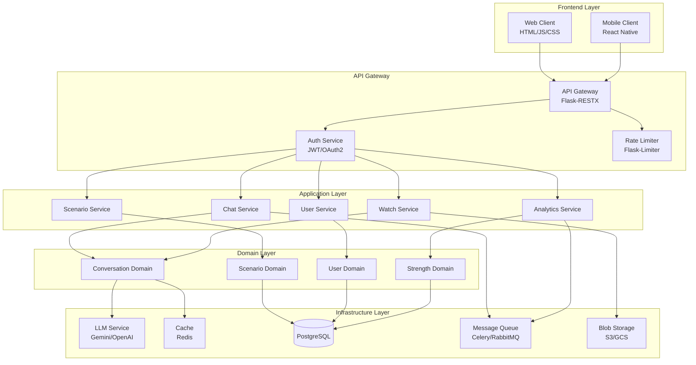
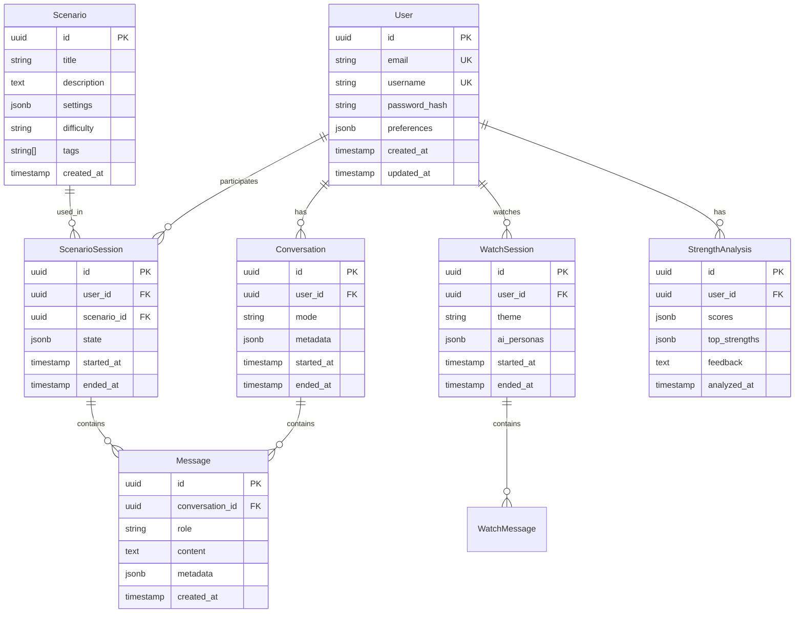

# Workplace Roleplay システム設計書 v2.0

## 1. 概要

### 1.1 設計方針
本設計は、既存の要件定義書と現状の課題分析を基に、スケーラブルで保守性の高いアーキテクチャを提案します。

**主要な改善点**:
- モノリシックな`app.py`からレイヤードアーキテクチャへの移行
- サービス層の導入による責務の分離
- 非同期処理の活用によるパフォーマンス向上
- セキュリティとスケーラビリティの強化

### 1.2 設計原則
- **DDD (Domain-Driven Design)**: ドメインロジックの明確な分離
- **SOLID原則**: 保守性と拡張性の確保
- **12 Factor App**: クラウドネイティブな設計
- **セキュリティファースト**: ゼロトラストアーキテクチャ

## 2. システムアーキテクチャ

### 2.1 全体構成



### 2.2 レイヤー構成

```
workplace-roleplay/
├── src/
│   ├── api/                    # API層
│   │   ├── __init__.py
│   │   ├── auth/              # 認証API
│   │   ├── chat/              # チャットAPI
│   │   ├── scenario/          # シナリオAPI
│   │   ├── watch/             # 観戦モードAPI
│   │   └── middleware/        # ミドルウェア
│   │
│   ├── application/           # アプリケーション層
│   │   ├── services/          # ビジネスロジック
│   │   │   ├── chat_service.py
│   │   │   ├── scenario_service.py
│   │   │   ├── watch_service.py
│   │   │   ├── user_service.py
│   │   │   └── analytics_service.py
│   │   └── dto/               # データ転送オブジェクト
│   │
│   ├── domain/                # ドメイン層
│   │   ├── entities/          # エンティティ
│   │   ├── value_objects/     # 値オブジェクト
│   │   ├── repositories/      # リポジトリインターフェース
│   │   └── services/          # ドメインサービス
│   │
│   ├── infrastructure/        # インフラ層
│   │   ├── persistence/       # データ永続化
│   │   ├── llm/              # LLM統合
│   │   ├── cache/            # キャッシュ
│   │   └── messaging/        # メッセージング
│   │
│   └── shared/               # 共通コンポーネント
│       ├── constants/        # 定数
│       ├── exceptions/       # 例外
│       └── utils/           # ユーティリティ
│
├── tests/                    # テスト
├── migrations/               # データベースマイグレーション
├── config/                   # 設定
└── scripts/                  # スクリプト
```

## 3. 詳細設計

### 3.1 API設計

#### 3.1.1 RESTful API エンドポイント

```yaml
# 認証API
POST   /api/v1/auth/register
POST   /api/v1/auth/login
POST   /api/v1/auth/refresh
POST   /api/v1/auth/logout

# ユーザーAPI
GET    /api/v1/users/me
PUT    /api/v1/users/me
DELETE /api/v1/users/me
GET    /api/v1/users/me/history

# チャットAPI
POST   /api/v1/chat/start
POST   /api/v1/chat/message
GET    /api/v1/chat/history
POST   /api/v1/chat/feedback
DELETE /api/v1/chat/session/{session_id}

# シナリオAPI
GET    /api/v1/scenarios
GET    /api/v1/scenarios/{scenario_id}
POST   /api/v1/scenarios/start
POST   /api/v1/scenarios/message
POST   /api/v1/scenarios/feedback

# 観戦モードAPI
POST   /api/v1/watch/start
GET    /api/v1/watch/stream/{session_id}
POST   /api/v1/watch/join/{session_id}
POST   /api/v1/watch/stop/{session_id}

# 分析API
GET    /api/v1/analytics/strengths
GET    /api/v1/analytics/progress
GET    /api/v1/analytics/report
```

#### 3.1.2 WebSocket API (リアルタイム通信)

```yaml
# WebSocket エンドポイント
WS /ws/chat/{session_id}
WS /ws/watch/{session_id}

# イベント
chat.message.new
chat.typing.start
chat.typing.stop
watch.ai.message
watch.user.join
watch.user.leave
```

### 3.2 データベース設計

#### 3.2.1 ER図



#### 3.2.2 インデックス戦略

```sql
-- パフォーマンス最適化のためのインデックス
CREATE INDEX idx_messages_conversation_created ON messages(conversation_id, created_at);
CREATE INDEX idx_conversations_user_started ON conversations(user_id, started_at DESC);
CREATE INDEX idx_scenario_sessions_user ON scenario_sessions(user_id, started_at DESC);
CREATE INDEX idx_strength_analysis_user ON strength_analysis(user_id, analyzed_at DESC);

-- 全文検索用インデックス
CREATE INDEX idx_messages_content_fts ON messages USING gin(to_tsvector('japanese', content));
```

### 3.3 サービス層設計

#### 3.3.1 ChatService

```python
from typing import List, Optional, AsyncGenerator
from domain.entities import User, Conversation, Message
from domain.repositories import ConversationRepository, MessageRepository
from infrastructure.llm import LLMService

class ChatService:
    def __init__(
        self,
        conversation_repo: ConversationRepository,
        message_repo: MessageRepository,
        llm_service: LLMService,
        cache_service: CacheService
    ):
        self.conversation_repo = conversation_repo
        self.message_repo = message_repo
        self.llm_service = llm_service
        self.cache_service = cache_service
    
    async def start_conversation(
        self, 
        user_id: str, 
        mode: str = "chat"
    ) -> Conversation:
        """新しい会話セッションを開始"""
        conversation = Conversation(
            user_id=user_id,
            mode=mode,
            metadata={"model": self.llm_service.current_model}
        )
        return await self.conversation_repo.save(conversation)
    
    async def send_message(
        self,
        conversation_id: str,
        content: str
    ) -> AsyncGenerator[str, None]:
        """メッセージを送信し、ストリーミングレスポンスを返す"""
        # メッセージ履歴を取得（キャッシュ活用）
        history = await self._get_conversation_history(conversation_id)
        
        # ユーザーメッセージを保存
        user_message = Message(
            conversation_id=conversation_id,
            role="user",
            content=content
        )
        await self.message_repo.save(user_message)
        
        # LLMレスポンスをストリーミング
        response_content = ""
        async for chunk in self.llm_service.stream_response(history, content):
            response_content += chunk
            yield chunk
        
        # AIレスポンスを保存
        ai_message = Message(
            conversation_id=conversation_id,
            role="assistant",
            content=response_content
        )
        await self.message_repo.save(ai_message)
        
        # キャッシュを更新
        await self._update_conversation_cache(conversation_id, [user_message, ai_message])
    
    async def _get_conversation_history(
        self, 
        conversation_id: str
    ) -> List[Message]:
        """会話履歴を取得（キャッシュ優先）"""
        cache_key = f"conversation:{conversation_id}:history"
        cached = await self.cache_service.get(cache_key)
        
        if cached:
            return cached
        
        messages = await self.message_repo.find_by_conversation(
            conversation_id,
            limit=50
        )
        await self.cache_service.set(cache_key, messages, ttl=3600)
        return messages
```

### 3.4 セキュリティ設計

#### 3.4.1 認証・認可

```python
from functools import wraps
from flask import request, g
from jose import jwt, JWTError
from datetime import datetime, timedelta

class AuthService:
    def __init__(self, secret_key: str, algorithm: str = "HS256"):
        self.secret_key = secret_key
        self.algorithm = algorithm
    
    def generate_tokens(self, user_id: str) -> dict:
        """アクセストークンとリフレッシュトークンを生成"""
        access_payload = {
            "sub": user_id,
            "type": "access",
            "exp": datetime.utcnow() + timedelta(minutes=30)
        }
        refresh_payload = {
            "sub": user_id,
            "type": "refresh",
            "exp": datetime.utcnow() + timedelta(days=7)
        }
        
        return {
            "access_token": jwt.encode(access_payload, self.secret_key, self.algorithm),
            "refresh_token": jwt.encode(refresh_payload, self.secret_key, self.algorithm)
        }
    
    def verify_token(self, token: str, token_type: str = "access") -> dict:
        """トークンを検証"""
        try:
            payload = jwt.decode(token, self.secret_key, algorithms=[self.algorithm])
            if payload.get("type") != token_type:
                raise JWTError("Invalid token type")
            return payload
        except JWTError:
            raise AuthenticationError("Invalid token")

def require_auth(f):
    """認証が必要なエンドポイント用デコレータ"""
    @wraps(f)
    async def decorated(*args, **kwargs):
        auth_header = request.headers.get("Authorization")
        if not auth_header or not auth_header.startswith("Bearer "):
            raise AuthenticationError("Missing authorization header")
        
        token = auth_header.split(" ")[1]
        auth_service = g.auth_service
        
        try:
            payload = auth_service.verify_token(token)
            g.current_user_id = payload["sub"]
        except AuthenticationError:
            raise
        
        return await f(*args, **kwargs)
    return decorated
```

#### 3.4.2 レート制限

```python
from flask_limiter import Limiter
from flask_limiter.util import get_remote_address

# レート制限の設定
limiter = Limiter(
    key_func=get_remote_address,
    default_limits=["200 per hour", "50 per minute"],
    storage_uri="redis://localhost:6379",
    strategy="fixed-window-elastic-expiry"
)

# API別のレート制限
rate_limits = {
    "chat_message": "30 per minute",
    "scenario_start": "10 per minute",
    "watch_start": "5 per minute",
    "analytics": "100 per hour"
}
```

### 3.5 パフォーマンス最適化

#### 3.5.1 キャッシュ戦略

```python
class CacheStrategy:
    """キャッシュ戦略の実装"""
    
    # キャッシュTTL設定
    TTL_SETTINGS = {
        "conversation_history": 3600,      # 1時間
        "user_preferences": 86400,         # 24時間
        "scenario_list": 3600,             # 1時間
        "strength_analysis": 604800,       # 7日間
        "model_response": 300              # 5分間
    }
    
    # キャッシュウォーミング対象
    WARM_CACHE_KEYS = [
        "scenarios:all",
        "models:available",
        "voices:list"
    ]
    
    @staticmethod
    def get_cache_key(entity_type: str, identifier: str) -> str:
        """キャッシュキーを生成"""
        return f"{entity_type}:{identifier}"
    
    @staticmethod
    def should_cache(entity_type: str) -> bool:
        """キャッシュすべきかどうかを判定"""
        return entity_type in CacheStrategy.TTL_SETTINGS
```

#### 3.5.2 非同期処理

```python
from celery import Celery
from typing import Dict, Any

# Celeryの設定
celery = Celery(
    "workplace_roleplay",
    broker="redis://localhost:6379/0",
    backend="redis://localhost:6379/1"
)

@celery.task(bind=True, max_retries=3)
def analyze_conversation_strength(self, conversation_id: str) -> Dict[str, Any]:
    """会話から強みを分析（非同期タスク）"""
    try:
        # 重い処理を非同期で実行
        analyzer = StrengthAnalyzer()
        result = analyzer.analyze(conversation_id)
        
        # 結果をキャッシュに保存
        cache_service.set(
            f"strength_analysis:{conversation_id}",
            result,
            ttl=86400
        )
        
        return result
    except Exception as exc:
        # リトライ処理
        raise self.retry(exc=exc, countdown=60)

@celery.task
def generate_monthly_report(user_id: str):
    """月次レポート生成（非同期タスク）"""
    report_generator = ReportGenerator()
    report = report_generator.create_monthly_report(user_id)
    
    # メール送信やストレージ保存
    email_service.send_report(user_id, report)
    storage_service.save_report(user_id, report)
```

### 3.6 監視・ロギング設計

#### 3.6.1 構造化ログ

```python
import structlog
from typing import Any, Dict

# ログ設定
structlog.configure(
    processors=[
        structlog.stdlib.filter_by_level,
        structlog.stdlib.add_logger_name,
        structlog.stdlib.add_log_level,
        structlog.stdlib.PositionalArgumentsFormatter(),
        structlog.processors.TimeStamper(fmt="iso"),
        structlog.processors.StackInfoRenderer(),
        structlog.processors.format_exc_info,
        structlog.processors.UnicodeDecoder(),
        structlog.processors.JSONRenderer()
    ],
    context_class=dict,
    logger_factory=structlog.stdlib.LoggerFactory(),
    cache_logger_on_first_use=True,
)

logger = structlog.get_logger()

# 使用例
logger.info(
    "conversation_started",
    user_id=user_id,
    conversation_id=conversation_id,
    mode="chat",
    model="gemini-1.5-pro"
)
```

#### 3.6.2 メトリクス収集

```python
from prometheus_client import Counter, Histogram, Gauge
import time

# メトリクス定義
conversation_counter = Counter(
    'conversations_total', 
    'Total number of conversations',
    ['mode', 'status']
)

response_time_histogram = Histogram(
    'llm_response_duration_seconds',
    'LLM response time in seconds',
    ['model', 'mode']
)

active_sessions_gauge = Gauge(
    'active_sessions',
    'Number of active sessions',
    ['type']
)

# 使用例
@response_time_histogram.time()
async def get_llm_response(prompt: str, model: str):
    """LLMレスポンス時間を計測"""
    return await llm_service.generate(prompt, model)
```

## 4. マイグレーション計画

### 4.1 フェーズ1: 基盤整備（2週間）

1. **プロジェクト構造の再編成**
   - 新しいディレクトリ構造の作成
   - 既存コードの整理と分類

2. **データベース設計と実装**
   - PostgreSQLのセットアップ
   - マイグレーションスクリプトの作成
   - 既存データの移行計画

3. **基本的なサービス層の実装**
   - ChatService, ScenarioService, WatchServiceの骨組み
   - リポジトリパターンの実装

### 4.2 フェーズ2: コア機能の移行（3週間）

1. **認証・認可システム**
   - JWT認証の実装
   - ユーザー管理機能の移行

2. **チャット機能の移行**
   - 既存のチャット機能をChatServiceへ
   - WebSocket対応

3. **シナリオ機能の移行**
   - シナリオ管理の改善
   - データベースへの移行

### 4.3 フェーズ3: 高度な機能（2週間）

1. **非同期処理の導入**
   - Celeryタスクの実装
   - バックグラウンドジョブの設定

2. **キャッシュ層の実装**
   - Redis統合の拡張
   - キャッシュ戦略の実装

3. **監視・ログシステム**
   - Prometheusメトリクス
   - 構造化ログの導入

### 4.4 フェーズ4: 最適化とテスト（1週間）

1. **パフォーマンステスト**
   - 負荷テストの実施
   - ボトルネックの特定と改善

2. **セキュリティ監査**
   - ペネトレーションテスト
   - 脆弱性の修正

3. **本番環境への移行**
   - Blue-Greenデプロイメント
   - 段階的なトラフィック移行

## 5. 技術スタック

### 5.1 バックエンド
- **言語**: Python 3.11+
- **フレームワーク**: Flask 3.0 + Flask-RESTX
- **非同期**: Celery + Redis
- **ORM**: SQLAlchemy 2.0
- **認証**: Flask-JWT-Extended

### 5.2 データベース
- **メインDB**: PostgreSQL 15
- **キャッシュ**: Redis 7
- **セッション**: Redis
- **全文検索**: PostgreSQL FTS

### 5.3 インフラ
- **コンテナ**: Docker + Docker Compose
- **オーケストレーション**: Kubernetes (本番)
- **CI/CD**: GitHub Actions
- **監視**: Prometheus + Grafana

### 5.4 LLM統合
- **メインLLM**: Google Gemini API
- **フォールバック**: OpenAI API
- **ローカルLLM**: Ollama (オプション)

## 6. まとめ

この設計により、以下の改善が期待できます：

1. **保守性の向上**: 明確な責務分離とレイヤードアーキテクチャ
2. **スケーラビリティ**: 非同期処理とマイクロサービス化への道筋
3. **パフォーマンス**: キャッシュ戦略と最適化されたDB設計
4. **セキュリティ**: ゼロトラストアーキテクチャとレート制限
5. **開発効率**: 標準化されたAPI設計とテスト戦略

段階的な移行により、既存機能を維持しながら着実に改善を進めることができます。