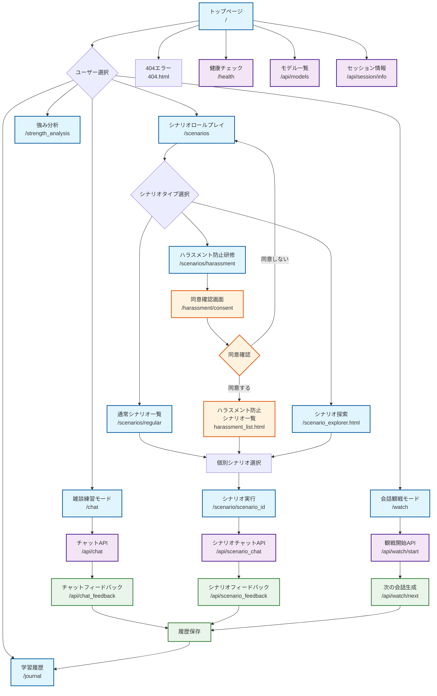
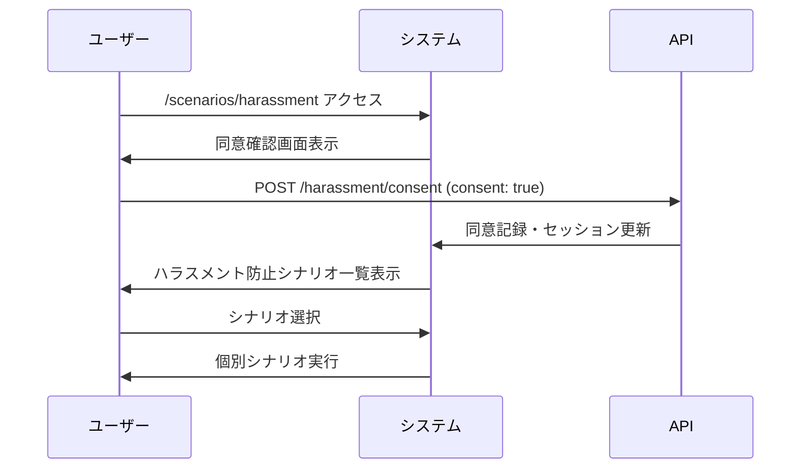
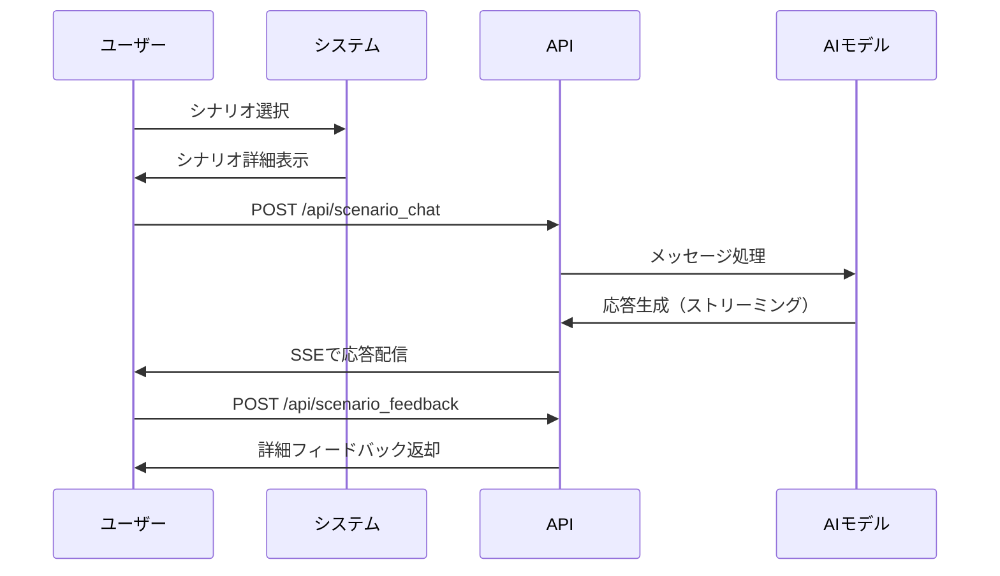
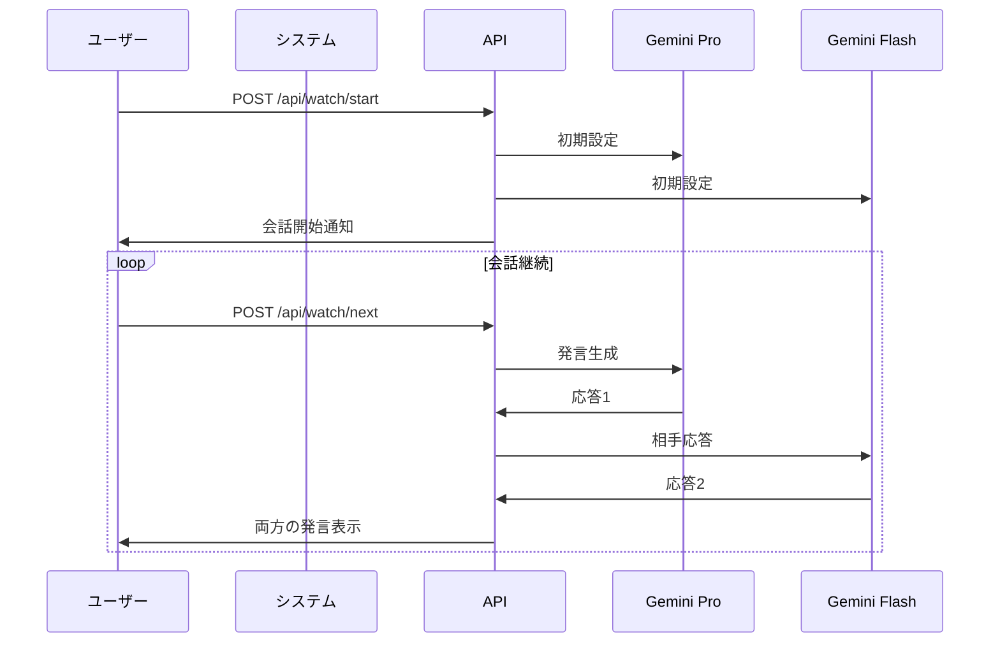

# 職場ロールプレイアプリ - 画面遷移図

## 概要

このドキュメントは、職場コミュニケーション練習アプリの画面遷移とユーザーフローを詳細に説明します。アプリケーションは5つの主要モードと特別なハラスメント防止研修フローを持ちます。

## 全体画面遷移図（Mermaid）



## 主要画面とその役割

### 1. エントリーポイント

#### トップページ（/）
- **ファイル**: `templates/index.html`
- **役割**: アプリケーションの入口、全機能への導線
- **主要機能**:
  - AIモデル選択（Google Gemini）
  - 5つの練習モード選択
  - アプリケーション概要説明
  - 使い方ガイド

### 2. メイン機能画面

#### 雑談練習モード（/chat）
- **ファイル**: `templates/chat.html`
- **役割**: ビジネス雑談スキル向上
- **特徴**: 
  - リアルタイムチャット（SSE）
  - 音声読み上げ対応
  - フィードバック機能
- **API連携**: `/api/chat`, `/api/chat_feedback`

#### シナリオロールプレイ（/scenarios）
- **ファイル**: `templates/scenarios_list.html`
- **役割**: シナリオ選択のハブ
- **分岐先**:
  - 通常シナリオ（/scenarios/regular）
  - ハラスメント防止研修（/scenarios/harassment）
  - シナリオ探索（scenario_explorer.html）

#### 会話観戦モード（/watch）
- **ファイル**: `templates/watch.html`
- **役割**: AIモデル同士の会話観察
- **特徴**: 2つのAIモデル間での対話デモ
- **API連携**: `/api/watch/start`, `/api/watch/next`

#### 学習履歴（/journal）
- **ファイル**: `templates/journal.html`
- **役割**: 過去の練習履歴と進捗確認
- **機能**: セッション履歴、振り返り機能

#### 強み分析（/strength_analysis）
- **ファイル**: `templates/strength_analysis.html`
- **役割**: コミュニケーション強みの分析
- **API連携**: `/api/strength_analysis`

### 3. ハラスメント防止研修フロー

#### 同意確認画面（/harassment/consent）
- **ファイル**: `templates/scenarios/harassment_consent.html`
- **役割**: 研修開始前の重要事項確認
- **特徴**:
  - 明確な同意取得プロセス
  - 研修内容の事前説明
  - 同意後のみ研修シナリオアクセス可能

#### ハラスメント防止シナリオ一覧
- **ファイル**: `templates/scenarios/harassment_list.html`
- **役割**: 専門シナリオの一覧と選択
- **特徴**: グレーゾーン含む実践的シナリオ

### 4. シナリオ実行画面

#### 個別シナリオ（/scenario/<scenario_id>）
- **ファイル**: `templates/scenario.html`
- **役割**: 実際のロールプレイ実行
- **特徴**:
  - シナリオ概要表示
  - 学習ポイント明示
  - リアルタイム対話
  - フィードバック取得
- **API連携**: `/api/scenario_chat`, `/api/scenario_feedback`

## API エンドポイント体系

### チャット・コミュニケーション系
- `POST /api/chat` - 雑談モードメッセージ送信（SSE）
- `POST /api/scenario_chat` - シナリオモードメッセージ送信（SSE）
- `POST /api/watch/start` - 観戦モード開始
- `POST /api/watch/next` - 観戦モード次の発言生成

### フィードバック系
- `POST /api/chat_feedback` - 雑談練習フィードバック
- `POST /api/scenario_feedback` - シナリオ練習フィードバック
- `POST /api/strength_analysis` - 強み分析実行

### セッション管理系
- `POST /api/clear_history` - 履歴クリア
- `POST /api/scenario_clear` - シナリオ履歴クリア
- `GET /api/session/info` - セッション情報取得
- `POST /api/session/clear` - セッションクリア
- `GET /api/session/health` - セッション状態確認

### 設定・メタ情報系
- `GET /api/models` - 利用可能AIモデル一覧
- `GET /api/csrf-token` - CSRFトークン取得
- `GET /api/categorized_scenarios` - カテゴリ別シナリオ一覧
- `GET /api/scenario/<scenario_id>/category` - 個別シナリオカテゴリ取得

### 音声・メディア系
- `POST /api/tts` - 音声合成
- `GET /api/tts/voices` - 利用可能音声一覧
- `GET /api/tts/styles` - 音声スタイル一覧
- `POST /api/generate_character_image` - キャラクター画像生成

### その他
- `GET /health` - アプリケーション健康状態
- `POST /api/get_assist` - アシスト機能
- `POST /api/start_chat` - チャット開始
- `POST /api/conversation_history` - 会話履歴取得
- `GET /api/key_status` - APIキー状態確認

## 特徴的な遷移パターン

### 1. ハラスメント防止研修フロー


### 2. シナリオ実行フロー


### 3. 観戦モードフロー


## セッション管理戦略

### セッション構造
```javascript
session = {
  'conversation_history': [],      // 雑談履歴
  'scenario_history': {},          // シナリオ別履歴
  'watch_history': [],             // 観戦履歴
  'selected_model': 'gemini-1.5-pro',  // 選択モデル
  'harassment_consent': false,     // ハラスメント研修同意状況
  'current_scenario': null,        // 現在のシナリオ
  'user_preferences': {}           // ユーザー設定
}
```

## エラーハンドリングパターン

### 1. APIエラー
- 各APIエンドポイントでtry-catch実装
- Gemini API固有エラー処理
- ユーザーフレンドリーなエラーメッセージ

### 2. セッションエラー
- セッション切れ時の自動回復
- データ整合性確保

### 3. 404エラー
- 専用の404.htmlページ
- 適切な導線提供

## 技術的特徴

### 1. Server-Sent Events (SSE)
- チャット応答のリアルタイム配信
- プログレッシブ応答表示

### 2. 動的コンテンツ読み込み
- JavaScript による非同期コンテンツ更新
- シナリオ動的フィルタリング

### 3. 音声読み上げ
- Web Speech API統合
- 多言語・多音声対応

## パフォーマンス考慮事項

### 1. メモリ管理
- モード別独立メモリ
- 適切なセッションクリア

### 2. API効率化
- ストリーミング応答
- 適切なタイムアウト設定

### 3. ユーザビリティ
- レスポンシブデザイン
- 直感的な操作フロー

---

**注意**: この画面遷移図は現在のコードベース（app.py、templates/）に基づいて作成されています。機能追加や変更時は、本ドキュメントの更新も必要です。