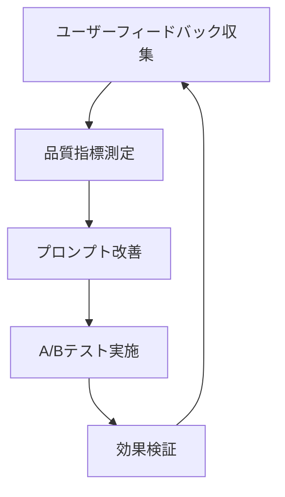

# フィードバックプロンプト改善提案とベストプラクティス

## 即実装可能な改善提案

### 1. 視点一貫性の強化
**現在の課題:** 評価者視点が混在している
```markdown
// 修正前
※あなた（ユーザー）への直接的なアドバイスとして、相手（AI）との会話を評価します

// 修正後（推奨）
※以下は、あなたの発言とコミュニケーションスタイルに対する建設的な分析です
```

### 2. 表記統一とシンプル化
**現在の課題:** 冗長な指示と表記ゆれ
```python
# 推奨: 共通指示テンプレート
FEEDBACK_INSTRUCTION_TEMPLATE = """
# 指示: ユーザーの成長を支援する実践的なフィードバックを生成してください。
- 視点: ユーザーの発言と行動に焦点
- 構造: 成功例 → 成長機会 → 実践アクション
- 文体: 励ましと具体性を重視
"""
```

### 3. レスポンシブ対応の改善
**現在の課題:** モバイル端末での視認性懸念
```css
/* 推奨CSS追加 */
.feedback-content {
    font-size: clamp(14px, 2.5vw, 16px);
    line-height: 1.6;
}
.feedback-emoji {
    font-size: 1.2em;
    margin-right: 0.5em;
}
@media (max-width: 768px) {
    .feedback-structure {
        padding: 0.75rem;
        margin: 0.5rem 0;
    }
}
```

## 長期戦略改善案

### 1. パーソナライズドフィードバック
**実装案:** ユーザーの学習履歴を活用した適応型プロンプト
```python
def generate_personalized_prompt(user_history, current_scenario):
    """
    ユーザーの過去の成長パターンと弱点分析に基づく
    カスタマイズされたフィードバックプロンプトを生成
    """
    weak_areas = analyze_user_weak_areas(user_history)
    strong_areas = analyze_user_strengths(user_history)
    
    return f"""
    【個別最適化フィードバック】
    注力領域: {weak_areas[:2]}  # 上位2つの改善機会
    活用可能な強み: {strong_areas[:1]}  # 最大の強みを活用
    """
```

### 2. 段階的開示システム
**実装案:** ユーザーの理解度に応じた情報段階的表示
```javascript
// フィードバック段階表示システム
class ProgressiveFeedbackDisplay {
    constructor(feedbackData) {
        this.levels = [
            { name: '概要', content: feedbackData.summary },
            { name: '詳細分析', content: feedbackData.detailed },
            { name: '実践ガイド', content: feedbackData.actionable }
        ];
        this.currentLevel = 0;
    }
    
    showNextLevel() {
        // ユーザーの準備ができたら次の詳細レベルを表示
    }
}
```

### 3. 多様性と包括性の強化
**実装案:** 文化的背景とコミュニケーションスタイルの多様性対応
```python
COMMUNICATION_STYLE_VARIATIONS = {
    'direct': '直接的で明確なコミュニケーション',
    'contextual': '文脈重視の間接的コミュニケーション',
    'collaborative': '協調性重視のコミュニケーション',
    'analytical': '論理的で構造化されたコミュニケーション'
}

def adapt_feedback_to_style(base_feedback, user_style):
    """
    ユーザーのコミュニケーションスタイルに応じた
    フィードバックの表現調整
    """
```

## ベストプラクティス実装ガイド

### 1. フィードバック生成の黄金律
1. **SMART原則適用**: Specific, Measurable, Achievable, Relevant, Time-bound
2. **ポジティブ・サンドイッチ**: 成功例 → 改善機会 → 励まし
3. **認知負荷軽減**: 一度に3つ以下の改善点に絞る

### 2. AI倫理ガイドライン
```python
ETHICAL_FEEDBACK_GUIDELINES = {
    'respect': 'ユーザーの尊厳と自主性を尊重',
    'fairness': '偏見のない公平な評価',
    'transparency': '評価基準の明確性',
    'empowerment': 'ユーザーの成長と自信向上'
}
```

### 3. 継続的改善フレームワーク


## 実装優先度

### 高優先度（即実装推奨）
1. ✅ 視点一貫性の修正（2-3時間）
2. ✅ 表記統一（1-2時間）
3. ✅ モバイル対応CSS改善（2-3時間）

### 中優先度（1-2週間以内）
1. 🔄 フィードバック品質検証システム
2. 🔄 段階的開示UI実装
3. 🔄 ユーザビリティテスト設計

### 低優先度（長期計画）
1. ⏳ パーソナライズドフィードバック
2. ⏳ 多言語対応
3. ⏳ AI倫理監査システム

## 測定指標

### 定量指標
- フィードバック満足度スコア（1-5点）
- 改善策実践率（％）
- 継続利用率（週次/月次）

### 定性指標
- ユーザーコメント分析
- サポートへの問い合わせ内容
- 学習効果に関する自己評価

---

*このドキュメントは修正されたフィードバックプロンプトの統合レビュー結果に基づいて作成されました。*